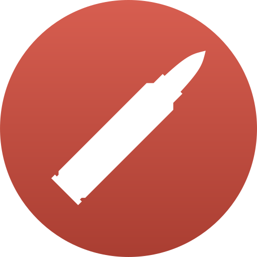

<h1> <a href="https://phosphorous.gitlab.io/calibre">
 Calibre
</a> </h1>

Platform-agnostic composable weapons framework, acting as an expansion to the Sokol composition framework to
create fully customisable, modular and complex weapons systems, from firearms to explosives.

### [Quickstart and documentation](https://phosphorous.gitlab.io/calibre)
